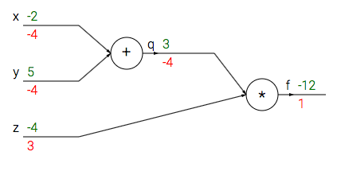

{:toc}
<h3>Back propagation</h3>
이번에는 인공 신경망 학습의 가장 중요한 부분인 back propagation이 무엇인지 정리해봅니다. back propagation가 뭔지, 어떤 과정을 거쳐 gradient를 구하는 지 볼게요. Back propagation은 지금의 딥러닝을 존재하게 한 방법입니다. 이 방법을 가장 처음으로 소개한 논문은 Yann LeCun의 Back propagation applied to handwritten zip code recognition, 1989에서 소개되었습니다. Back propagtion은 gradient를 구하기 위한 과정으로 feed forward 과정을 통해 loss를 구한 후 실행합니다. 이름 그대로 output layer에서 input layer로 가는 과정을 뜻합니다. 뒤로 가면서 gradient를 구하는 과정에서 각 레이어의 gradient를 구하기 위해 chain rule을 사용합니다.

<a href="http://www.mitpressjournals.org/doi/abs/10.1162/neco.1989.1.4.541">LeCun 논문 원문보기</a>

<h3>Neural Net</h3>
인공 신경망은 input, hidden, output layer로 구성되어 있고 학습을 통해 $f(x)$에 근사한 $f^{*}(x; \theta)$를 찾는 과정이기도 합니다. 즉, 최적의 weights와 bias를 찾아가는 것인데 아주 복잡한 함수를 찾아가는 과정으로 보아도 되죠. Interpolation과 비슷한 거 같기도 합니다.

 

그림을 보면 전기 신호를 받는 dendrites에 해당하는 것이 input layer 입니다. 여기서 받아진 값들은 cell body에 해당하는 hidden layer에서 어떠한 과정을 거쳐 $\sum_{i}w_i x_i +b$와 같은 값을 낸 후 axon에 해당하는 output layer로 갑니다. 뉴런에서는 어떠한 과정을 거쳐 전기 신호가 전달되거나 하지만 인공 신경망에서는 activation function이라는 것을 거칩니다. 이 함수는 말 그대로 값을 활성화 합니다. sigmoid, relu, tanh 등이 쓰입니다. 출력된 값은 데이터의 label 즉, y값에 의해 평가를 받습니다. 그리고 값이 틀리다면(당연히 계속 틀리지만) weight와 bias를 재조정하여 다시 평가를 받습니다. 딥러닝은 이 과정을 계속 하는 것입니다. input-hidden-output으로의 과정을 feed-forward라고 합니다. 그리고 값을 평가 받은 후 다시 weight를 재조정하는 과정을 back-propagation이라고 합니다.
<ul>
 	<li>Gradient를 구하는 것은 weight를 재조정하기 위해서이다. </li>
 	<li>인공 신경망에서는 gradient를 구하는 것이 단번에 이루어지지 않는다. 여러 개의 레이어로 되어있는 신경망의 특성상 여러 함수가 합성되어 있어 Chain rule을 통해 각 레이어의 gradient를 구한다.</li>
</ul>
먼저 지금 예시로 들 chain-rule을 이용한 back-propagation 과정을 이해하려면 다음의 미분을 알아야합니다. $f(x,y) = x+y \rightarrow \frac{df}{dx} = 1,~\frac{df}{dy} = 1$ $f(x,y) = xy \rightarrow \frac{df}{dx}=y, ~ \frac{df}{dy}=x$ 각각의 편미분 값을 기억합시다.

간단한 예로 다음의 함수를 봅시다.

<ul>
 	<li>$f(x,y,z) = (x+y)z$ 이 식에서 $x+y=q$와 같이 치환될 수 있고 $f=qz$와 같이 표현될 수 있습니다. 위의 미분과 같이 편미분을 해주면 $\frac{\partial f}{\partial q} = z, ~\frac{\partial f}{\partial z} = q$ 그리고 $q= x+y$이므로 한번 더 미분이 가능합니다.</li>
 	<li>chain rule에 의해 다음과 같이 나옵니다. $\frac{df}{dq} \frac{dq}{dx} = 1,~ \frac{df}{dq} \frac{dq}{dy} = 1$</li>
 	<li>결국, $\frac{df}{dx} =1, \frac{df}{dy}=1, \frac{df}{dz} = x+y $를 구합니다. 미분의 정의에 따라 이것은 f에 대한 x,y,z의 민감도입니다. 이것을 back-prop의 관점으로 봅니다. 초록 값은 input 값, feed-forward이고 빨간색은 gradient, back-prop 값입니다.</li>
 	<li>가장 먼저 f에 대한 f의 미분은 1입니다. 다음 $x+y$와 $z$의 곱의 각각의 편미분을 보면 z의 편미분값은 위의 식(1)에 따라 x+y이고 x+y의 편미분 값은 z 입니다. 이제 $(x+y)$를 x,y 각각으로 편미분을 하면 둘다 1의 값이 나옵니다.</li>
 	<li>따라서 chain rule을 적용하면 $\frac{d(x+y)}{dx}*\frac{df}{d(x+y)} = 1*-4 = -4$ 이고 y도 똑같습니다.</li>
</ul>
