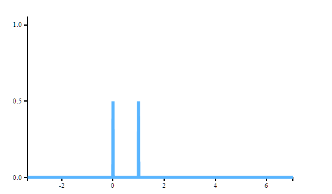
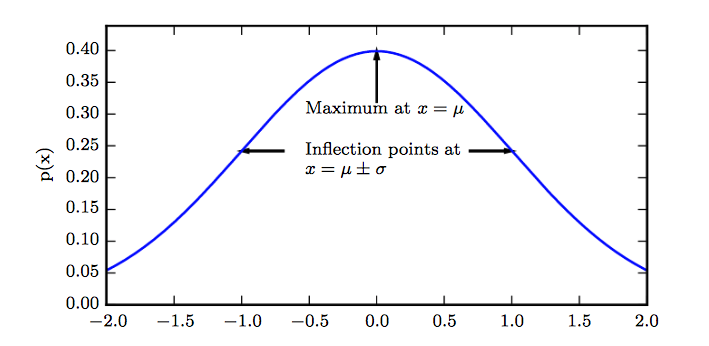
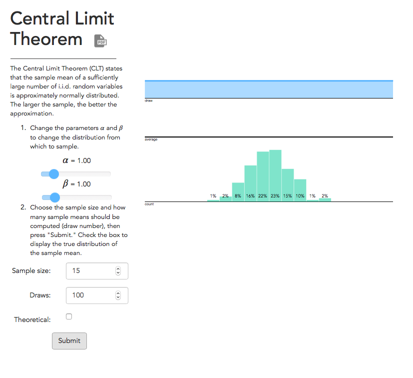
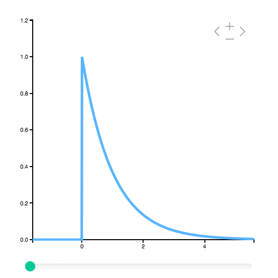

<h2>Intro</h2>
본 포스팅은 Deep Learning - Ian goodfellow, Mathematical statistic - Hogg 를 공부하며 정리한 내용입니다.

이번에는 기본적인 확률에 관한 내용입니다.
확률은 기본적으로 거의 대부분의 공학, 과학 분야에서 사용되는 기본적인 도구이고 역시 인공지능에서도 중요한 부분을 차지합니다. 인공지능에서 확률은 크게 두가지 방법으로 쓰입니다.
<li>
인공지능 시스템은 확률 법칙을 이용하여 무언가를 추론해야한다. 확률을 이용해 많은 식, 변수를 계산하거나 근사하는 알고리즘을 만든다.
</li>
<li>
인공지능 시스템의 행동을 분석하기 위해 확률과 통계를 사용한다.
</li>
 

또 일반적인 컴퓨터 과학과는 다르게 기계학습은 대부분 불확실한 것과 확률적인 것을 다루므로 기계학습자에게 확률은 아주 중요한 도구입니다.

<h2>Frequentist, bayesian probability</h2>

확률이 불확실성을 표현하고 추론하는것은 맞지만, 그것이 인공지능 분야에서 요구하는 도구를 모두 제공하지는 않습니다. 기존의 확률 이론은 사건의 빈도수를 분석하기 위해 발전해왔습니다. 특히, 확률에 관한 책을 보면 주로 동전이나 카드를 가지고 이야기하는 것을 자주 볼 수 있는데, 이것들이 반복되는 사건의 아주 쉽고 대표적인 예입니다. 어떤 사건이 발생할 확률이 p라고 하는 것은, 어떤 사건을 무한히 반복했을 때 p의 비율로 사건이 발생한다는 것을 뜻합니다. 하지만 이런 예는 반복되는 사건이 아니라면 적용하기 어렵죠. 만일 의사가 환자에게 감기가 걸릴 확률이 40%라고 한다면, 이건 좀 다른 의미를 가집니다. 생물적으로 같은 환자를 무한히 반복하는 것은 말이 안되고 또 여러 환자들이 같은 환경을 갖고 있지도 않기 때문입니다. 동전, 카드와 달리 변수들이 굉장히 많죠. 이런 경우에는 **믿음**의 정도를 나타내기 위해 확률을 사용합니다. **믿음** 이라는 것이 중요합니다. 위의 동전, 카드의 경우를 frequentist probability라고 하고 후자를 bayesian probability라고 합니다. 통계학은 크게 두 분야로 이루어져 있습니다.
또 다른 관점에서, 확률은 불확실성을 다루는 논리의 연속이기도 합니다. 논리는 명제가 참이거나 거짓임을 결정하는 규칙을 제공합니다. 이런 관점에서 확률은 명제가 참이거나 거짓일 가능성을 제공하는 도구입니다.

<h2>Probability distribution</h2>
확률 분포는 확률 변수(들)이 가진 분포의 모양을 설명합니다. 확률 변수란 $x _ {1},...x _ {n}$와 같은 데이터를 말합니다. 정확히는 확률 변수는 함수입니다. 이 데이터의 분포가 어떤 모양을 갖고 있는 지는 데이터의 확률 분포에 따라 다르죠. 그리고 이런 확률 분포는 이산형 변수와 연속형 변수로 종류가 나뉩니다.
<h2>이산형 변수와 PMF</h2>
이산형 변수의 분포는 확률 질량 함수, Probability mass function(PMF)로 나타냅니다. PMF는 관습적으로 P로 나타내죠. 그래서 여러가지 PMF가 나올 때는 PMF $P(x), ~ P(y)$를 다른 것으로 읽도록 주의해야 합니다. 이 부분이 확률을 처음 접하는 분에겐 쉽게 익숙해지지 않는 부분이죠.
PMF는 확률 변수를 PMF에 해당하는 확률 변수의 확률로 나타냅니다. x = $x$일 확률은 $P(x)$로 표기합니다. x = $x$이 확실하면 이 확률은 1이고, 불가능하다면 0 이 됩니다. PMF를 표현하는 다른 방식은 확률 변수를 함수안에 명시하는 방법입다. P(x = $x$) 혹은 x~P(x)와 같이 표현합니다.
PMF는 여러 변수를 다루기도 하는데 그런 확률 분포를 joint probability distribution이라고 합니다. P(x=$x$, y=$y$),$P(x,y)$로 표기 합니다.
확률 변수의 PMF가 되는 함수 P는 밑의 조건을 만족해야 합니다.
<li>
P의 정의역은 x의 모든 집합이다.
</li>
<li>
모든 x에 대해서 $0 \leq P(x) \leq 1$이다.
</li>
<li>
$\sum _ {x} P(x) =1$ 이다.
</li>

<h3>예</h3>
쉬운 예로 이산형 변수인 x가 k개 있다고 하자. 이 x는 uniform distribution에서 뽑았다. 즉, 각각의 x의 확률을 PMF로 나타내보면 $$P(x=x _ {i}) = \frac {1} {k}$$ 이것을 위의 PMF 조건에 넣어보면 모두 만족함을 알 수 있다.

<h2>연속형 변수와 PDF</h2>
연속형 변수에서는 확률 밀도 함수, probability density function(PDF)로 확률 분포를 설명합니다. PDF인 함수 p 역시 다음의 조건을 만족시켜야 합니다.

<li>
p의 정의역은 모든 x의 집합이다.
</li>
<li>
모든 x에 대해서 $p(x) \geq 0$ 이다.
</li>
<li>
$\int p(x) dx = 1$ 이다.
</li>

PDF는 x에서의 정확한 확률을 표현하는 것이 아니라 정해진 구간에서의 확률을 표현합다. 연속형 변수임을 생각하면 어떤 x는 구간 내에 무한히 많은 순간 중 아주 짧은 순간이기 때문에 0의 확률을 가지기 때문입니다. 그래서 확률은 구간 $[a,b]$를 적분하여 $\int _ {[a,b]} p(x) dx$로 나타냅니다.

<h2>Marginal Probability</h2>
주변 확률 분포라고 부르는 Marginal probability 입니다. 어떤 변수들의 대한 확률 분포를 알고 있을 때, 그 변수들의 하위 집합(subset)의 분포를 알아야 할 때가 있습니다. 이런 하위 집합에 대한 확률 분포를 marginal probability distribution 이라고 합니다.
예를 들어, 이산형 변수 x, y가 있고 P(x,y)를 알고 있을 때, 덧셈 규칙을 이용해서 P(x)를 구할 수 있습니다.
$$\forall x , ~ P(x=x)=\sum _ {y} P(x=x,y=y)$$ 연속형 변수인 경우 $$p(x) = \int p _ {x,y} dy$$로 표현합니다.

<h2>Conditional Probability</h2>
어떤 특정한 사건이 발생했을 때의 확률이 필요하기도 합니다. 이것을 나타내는 확률을 조건부 확률 Conditional probability라고 합니다. x = $x$가 발생했을 때의 y = $y$를 $P(y=y | x=x)$로 표현합니다. 그리고 이 조건부 확률은 다음처럼 계산됩니다. $$P(y=y | x=x) = \frac {P(y=y,x=x} {P(x=x)}$$ 위 식에서 볼 수 있듯이, 조건부 확률은 $P(x=x) < 0$에서만 정의됩니다. 수학적으로 분모가 0인 분수는 정의되지 않고, 조건부 확률의 의미를 본다면, 일어나지도 않은 사건을 조건으로 확률을 계산할 수 없기 때문이죠.
조건은 한 가지 사건만이 아니라 여러가지 사건이 될 수 있습니다. 즉 $x _ {1},...,x _ {i-1}$이 발생했을 때의 확률도 구할 수 있습니다.

<h2>Expectation, Variance, Covariance</h2>

 

확률 분포 $P(x)$를 가진 함수 f의 기댓값(Expectation)은 평균을 뜻합니다. 이산형 변수에서는 다음과 같이 계산됩니다. $$\mathbb{E} _ {x \sim P} [f(x)] = \sum _ {x} P(x) f(x)$$
연속형 변수에서의 기댓값은 다음과 같습니다. $$\mathbb{E} _ {x \sim p} [f(x)] = \int p(x) f(x) dx$$
확률 분포가 명시되어 있을 때 확률 변수를 생략하고 간단하게 표현하기도 합니다. $\mathbb{E} [f(x)]$. 보통 $\mathbb{E} [.]$는 기댓값을 뜻하고 경우에 따라 []를 빼기도 합니다.
기댓값은 선형적 성질을 갖고 있기 때문에 다음 식이 성립합니다. $\mathbb{E} _ {x} [\alpha f(x) + \beta g(x)] = \alpha \mathbb{E} _ {x} [f(x)] + \beta \mathbb{E} _ {x} [g(x)]$

분산(Variance)는 확률 분포의 샘플 x의 다름의 정도에 따라 함수값이 얼마나 변하는 지를 나타냅니다. 분산이 작다면 함수의 모든 값들이 기댓값에 몰리게 되겠죠. 또한 분산의 제곱근을 표준오차라고 합니다. $$Var(f(x)) = \mathbb{E} [(f(x) - \mathbb{E} [f(x)]) ^ {2} ]$$

공분산(Covariance)은 두 값의 상관관계의 정도를 나타냅니다. $$Cov(f(x), g(y)) = \mathbb{E} [(f(x) - \mathbb{E} [f(x)]) (g(y) - \mathbb{E}[g(y)])]$$ 공분산의 절대값이 크다면 두 값의 상관관계가 크다는 것입니다. 공분산이 양수이면 두 값은 함꼐 증가하는 것으로 생각 할 수 있습니다.
공분산과 독립은 비슷하지만 다른 개념을 가지고 있습니다. 두 변수가 서로 독립이면 공분산은 0이고 공분산이 0이 아닌 두 변수는 서로 독립이 아니기 때문입니다. 하지만, 독립(Independence)는 공분산과는 구별되는 특성이 있습니다. 독립은 공분산 보다 좀 더 큰 조건입니다. 공분산이 0이라면 두 변수는 반드시 선형관계가 없다고 하지만, 독립인 두 변수는 선형이 아닌 관계도 제외해 버리기 때문입니다. **두 변수가 독립이 아니지만 공분산이 0일 수는 있습니다.**
벡터 $x \in \mathbb{R} ^ {n}$의 공분산 행렬은 n*n행렬을 가지는 $$Cov(X) _ {i,j} = Cov(x _ {i}, x _ {j}$$ 입니다.

<a href="https://en.wikipedia.org/wiki/Probability">위키보기</a>
<h2>Distribution</h2>
통계학에서 다루는 확률 분포는 숫자가 꽤 되고 몇몇 분포는 pdf로부터 기댓값을 구하는 것도 어렵습니다. 또 분포들 사이의 관계를 정리하는 것도 만만치 않습니다. 다행히 기계학습에서 쓰이는 분포는 통계를 몇번 보았다면 친숙한 분포들이고 그다지 어렵지 않은 분포들임을 눈치 채셨을 겁니다. 이번에는 bernolli, multinoulli, gaussian, exponential, laplace 분포를 보겠습니다.

<h3>Bernoulli distribution</h3>

몇 가지 분포를 시작하기에 앞서서 가장 간단한, 쉬운 분포인 베르누이 분포를 봅니다. 베르누이 분포는 Jacob Bernoulli(1654~1705)라는 스위스 수학자의 이름에서 나왔죠. 베르누이는 사실 어마어마한 업적들이 있는데 논리, 대수, 기하학등 여러 분야에 업적을 남겼습니다. 심지어 자연로그 e를 발견한 사람이 베르누이입니다.

bernoulli distribution은 단 두개의 변수만 있는 분포입니다. Parameter는 p만 있으며 이건 변수가 1이 될 확률을 의미합니다.
<li>
$P(x=1) = p$
</li>
<li>
$P(x=0) = 1-p$
</li>
<li>$P(x=x) = p ^ {x} (1-p) ^ {1-x}$
</li>
<li>
$\mathbb{E} _ {x} [x]=p$
</li>
<li>$Var(x) = p(1-p)$
</li>

 

<h3>Multinoulli distribution</h3>

Multinoulli, categorical 분포라고도 합니다. 이름에 맞게 k개의 변수를 다루는 분포입니다. Parameter $p \in [0,1] ^ {k-1}$를 갖고 있고 $p _ {i}$는 i번째의 상태에서의 변수가 1이 될 확률을 나타냅다. 마지막 k번째 변수의 확률은 $1-1 ^ {T} p$ 입니다. Multinoulli 분포는 주로 여러 개의 카테고리를 가진 데이터의 분포를 다룰 때 사용하고 변수가 1이 될 확률을 보지만 여기서의 1은 보통 숫자 1을 의미하진 않습니다. softmax와 비슷하죠. 이런 이유로 Multinomial에서 기댓값이나 분산은 굳이 구할 필요가 없습니다.

이 두가지 분포는 거의 모든 분야를 설명할 수 있습니다. 이 두가지 분포가 모든 상황을 설명할 수 있어서라기 보다는 이 두 분포가 가장 간단한 분포이기 때문인데, 세상의 거의 모든 문제는 사실 이산적인 문제로 변환할 수 있기 때문이죠.

<h3>Gaussian distribution</h3>

분포 중 가장 유명하고 많이 쓰이는 분포는 gaussian으로 normal distribution이라고도 불린다.
$$N(x; \mu , \sigma ^ {2})=\sqrt{ \frac {1} {2 \pi \sigma ^{2}} } exp(- \frac {1} {2 \sigma ^ {2}} (x- \mu ) ^ {2})$$
정규분포는 $\mu , \sigma$로 결정됩니다. $\mu$는 평균 값으로 중앙의 볼록한 곳, 평균의 위치를 결정하고 $\sigma $, 분산은 분포의 퍼짐 정도를 결정합니다. Normal distribution은 거의 모든 곳에서 쓰입니다. 만일 어떤 변수가 어떤 분포를 가지는 지 모른다면, 보통 normal dist. 를 사용하는 게 가장 좋죠. 왜냐면 거의 모든 변수들은 normal dist에 가깝습니다. The central limit theorem(중심 극한 정리)는 독립의 변수들의 함은 normal dist에 가까워진다는 걸 보여주기도 합니다. 이 말은 많은 복잡한 모델들은 데이터가 많아지면 어떤 것이든 normal dist 로 봐도 된다는 얘기입니다.
정규 분포 역시 다변수로 확장이 가능하고 multivariate normal distribution이라고 부릅니다. $$N(x; \mu , \Sigma ) = \sqrt{ \frac {1} {(2 \pi ) ^ {2} det( \Sigma )}} exp ( - \frac{1}{2} (x- \mu )^ {T} \Sigma ^ {-1} (x- \mu))$$ 여기서 $\Sigma$은 positive definite symmetric matrix이고 Covariance matrix와 동일합니다. $\mu$는 역시 평균을 뜻합니다.

<a href="http://students.brown.edu/seeing-theory/distributions/index.html#second">중심 극한 정리에 관한 좋은 자료는 여기</a>

<h3>Exponential and Laplace distribution</h3>

  

딥러닝을 공부하다 보면 x=0에서 뾰족한 모양을 가지는 분포가 필요할 때가 많습니다. 정규분포도 이 상황에 맞지만 좀 더 뾰족한 분포는 exponential dist입니다. $$p(x; \lambda) = \lambda \mathbb{1} _ {x \geq 0} exp( - \lambda x)$$ 여기서 $\mathbb{1} _ {x \geq 0}$은 indicator function이라고 부르고 밑의 조건이 충족되면 1, 그렇지 않으면 0을 뜻합니다. exponential dist 말고도 laplace dist도 이 상황에 사용 가능합니다. $$Laplace(x; \mu \gamma ) = \frac {1} {2 \gamma} exp (- \frac {|x- \mu |} { \gamma })$$

<h2>Estimators, Bias, Variance</h2>

대부분의 기계학습은 Statistical learning이라고 불리는 만큼, 통계학에서 쓰이는 도구를 사용하고 그것에 기초를 두고 있습니다. 기계학습의 가장 기본이 되는 개념은 parameter estimation, bias, variance 입니다. underfitting, overfitting의 개념을 이해하는데 필수적이고 딥러닝의 가장 기초를 이루고 있는 개념이기도 하죠.

<h3>Point Estimation</h3>

굳이 한글로 번역하자면 점추정법 입니다. 점추정은 어떤 것에 대해 한가지 최고의 좋은 예측을 하는 방법입니다. 추정을 하는 것은 변수 하나가 될 수 있고 여러가지 변수의 벡터가 될수도 있습니다. 역시 대부분은 여러 변수를 추정하는 것입니다. 또한 어떤 함수를 추정해야 할 때도 있습니다. 통계학에서는 추정치와 실제를 구분하기 위해 $\hat{\theta}$를 추정값으로 사용합니다.

$x_{1},...,x_{m}$의 iid한 데이터가 있다고 합니다. 그렇다면 point estimator 혹은 statistic은 이 데이터에 대한 함수이고 다음과 같이 표현합니다. $$ \hat{\theta} _ {m} = g( x_{1},...,x_{m}) $$ 여기서 함수 g는 꼭 $\theta$ 에 가까울 필요도 없고 어떤 범위 안에 들 필요도 없습니다. 데이터를 추정하는 자에게 높은 자유도를 주는 것입니다. 그래서 대부분의 함수는 estimator가 될 수 있습니다. 좋은 추정치는 $\hat{\theta}$와 $\theta$가 매우 비슷할 때입니다.

실제로 거의 모든 문제에서는 $\theta$를 알 방법이 없습니다. 주식 가격의 파라미터를 모르는 것이 당연한 것처럼요. 그래서 우리는 $\theta$가 고정되어 있으며 모르는 값이고 $\hat{\theta}$를 데이터의 함수라고 가정합니다. 데이터는 무작위로 얻어지기 때문에 데이터의 함수는 랜덤 변수입니다.

<h3>Bias</h3>

추정치의 Bias는 다음과 같이 정의됩니다. $$bias( \hat{\theta} _ {m} ) = \mathbb{E} (\hat{\theta} _ {m}) - \theta$$

쉽게는 예측값 - 실제값입니다. 여기서 $bias( \hat{\theta} _ {m} ) =0$이라면 $\hat{\theta} _ {m}$은 unbiased라고 합니다. 예측값과 실제값이 같다는 얘기입니다. 그리고 $lim _ { m \rightarrow \infty} bias( \hat{\theta} _ {m} ) =0$ 이라면 asymptotically unbiased라고 합니다. 데이터가 많아질수록 예측값과 실제값이 같아진다는 말입니다.

통계학을 배우다 보면 여러가지 estimator에 대한 성질을 배우게 됩다. unbiasedness는 그 중 가장 먼저 배우는 것이고 $\bar{X}$를 좋은 추정치로 배우게 됩니다. Unbiased estimator는 확실히 좋은 estimator이지만 항상 최고의 estimator는 아니라는 것을 알아두면 좋습니다.

<h3>Variance, S.E.</h3>

Estimator에 관해 또 하나 알아야할 것은 이것이 데이터 샘플에 따라 얼마나 달라지냐입니다. Bias를 구할 수 있다면 Variance도 구할 수 있습니다. Variance는 데이터의 여러 샘플에 따라 추정값이 얼마나 달라지냐를 값으로 보여줍니다. 샘플에 따라 추정값이 크게 변한다면 상식적으로 좋은 estimator가 아닐 것입니다. 그래서 variance 역시 작을수록 좋은 estimator입니다.

$\hat{ \mu } _ {m}$의 standard error는 $\sigma / \sqrt{m}$으로 구해집니다. $\sigma ^ {2}$는 데이터의 실제 variance이기 때문에 데이터가 많을수록 좋은 $\hat{ \mu}$ 를 구하게 됩니다. Estimator의 variance는 데이터가 많아질수록 작아지게 되는데 이것은 몇 estimator의 특징입니다. 다음 consistency에서 봅니다.

<h3>Consistency</h3>

기계학습에서 데이터의 양은 절대적인 지위를 갖습니다. 모델보다도 데이턱 더 중요한 자산이죠. 왜냐면 데이터가 많을수록 $ lim _ {m \rightarrow \infty} \hat{\theta} _ {m} \rightarrow ^ {p} \theta$ 로 기대하기 때문입니다. 즉, 데이터가 많을수록 좋은 모델을 얻을 수 있기 때문입니다. 위의 식을 consistency라고 부릅니다. 다음과 같이 표현되기도 합니다.
$$for ~ any ~ \epsilon < 0, ~ P(|\hat{theta} _ {m} - \theta | < \epsilon ) \rightarrow 0 ~ as ~ m \rightarrow \infty$$

Consistency는 데이터가 증가함에 따라 estimator의 bias가 작아진다는 것을 보여주기 때문에 중요한 성질 중 하나입니다. 여기서 consistency는 unbiased를 보증하지만 그 반대는 성립하지 않음을 알아두면 좋습니다.
