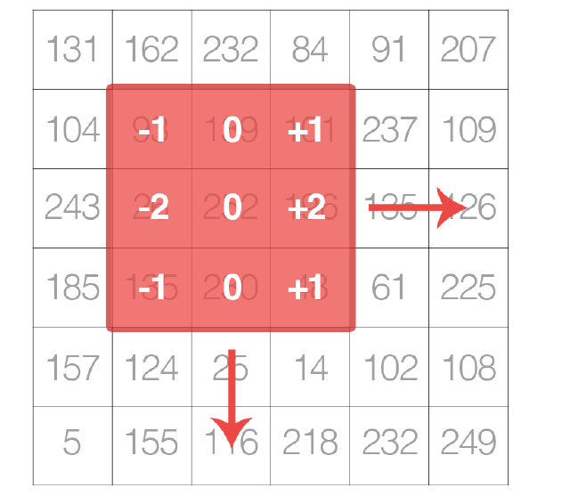

Deep Learning for Computer Vision - Dr. Adrian Rosebrock 을 보고 정리한 글입니다.

<h2>Convolution in CNN</h2>
이미지 처리 분야는 CNN이라는 이미지를 다루는 딥러닝 기법이 나옴과 함께 엄청나게 빠른 속도로 발전하는 분야입니다. 요즘은 이미지가 아닌 다른 곳에도 CNN 쓰기는 하지만 말입니다. 그럼 Convolutional Neural Net에서 Convolution이 뭘까요? 영어 사전에서는 뒤틀린 것, 꼬인 것 이라고 하지만 와닿지 않습니다.

<h3>Convolutional Neural Network</h3>

Input레이어와 그것의 output 레이어들로 구성된 신경망을 간단히 FC(Fully Connected) layer라고 합니다. 일반적인 행렬 곱과 활성 함수로 이뤄진 레이어죠. CNN에서 FC는 맨 마지막에 정리된? feature를 학습하는데 쓰이고 그 이전까지는 Convolutional layer로 이루어져 있습니다. Convolutional layer를 지나는 동안 신경망은 더 복잡한 것들을 학습해갑니다. 예를 들어, 가장 먼저 모서리들을 찾아내고, 다음 이 모서리들로 나타나는 어떤 형태를 학습합니다. 다음 이 형태들을 조합해 더 복잡한 무언가를 학습해갑니다. 낮은 레벨의 feature에서 높은 레벨의 feature로 배워나가죠. 사실 이 과정에는 pooling layer와 같은 것들도 있지만, convolution이 무엇인지만 봅니다.

 

<h3>Convolution</h3>

사실 Convolution이라는 건, 거의 모든 사람들이 알게 모르게 사용했을 겁니다. 이미지 블러처리, 뽀샤시 효과, 선명하게 하는 효과 모두 사실 convolution 입니다. 알고보니 이미지 분야에서 convolution은 굉장히 오래된 개념이라네요.

딥러닝에서 쓰이는 용어로 convolution을 보자면, convolution은 element wise matrix multiplication + sum 입니다. Convolution의 과정은 다음과 같이 나타낼 수도 있습니다.
<ol>
 	<li>두 행렬을 element wise로 곱한다.</li>
 	<li>sum(A)를 한다.</li>
</ol>

수학적으로 표현한다면 다음과 같습니다. $$S(i,j) = convolution(I,K)(i,j) = \sum _ {m} \sum _ {n} K(i+m, j+n) I(m,n), ~ K=kernel,~ I = input ~ image$$

이미지는 결국 width*height*channel로 이루어진 Multidimensional matrix 입니다. 즉, 거대한 행렬이죠. Kernel 혹은 Convolution은 그럼 블러 처리, 뽀샤시 효과 등을 처리하는 작은 행렬입니다. 이 작은 행렬은 큰 행렬의 앞에서 왼쪽에서 오른쪽으로, 위에서 아래로 이동하며 값들을 뽑아내는 것입니다. CNN에서는 이 작은 행렬을 Kernel이라고 합니다.

 

이 작은 행렬이 일하는 과정은 다음 강의에 잘 나와있습니다.

<a href="https://www.youtube.com/watch?v=jajksuQW4mc&amp;list=PLAwxTw4SYaPn_OWPFT9ulXLuQrImzHfOV&amp;index=37">Udacity CNN</a>

<h3>Kernel, Conv layer</h3>

딥러닝에서 쓰이는 kernel은 n*n의 행렬이고 홀수의 n을 사용합니다. 이유는 간단합니다. 이미지를 이루는 픽셀은 정수라서,짝수 크기의 kernel을 사용한다면 밑 그림과 같은 일이 발생하기 때문이죠.

 

보통 Convolution layer에서는 kernel을 사용해 이미지의 여러 특징들을 학습합니다. 회전된 이미지, 변형된 이미지 등등 kernel로 되는 모든 transformation 말입니다. Convolution은 사실 행렬 곱과 sum으로 이루어져 있다는 것을 알면 됩니다.

<h2>Other layers</h2>

Conv layer는 CNN의 핵심 레이어로 이미지를 여러 필터로 적용해 나타낸 후 모은 결과입니다. 이것과 Pooling, FC, Activation, Batch  normalization, Drop out 레이어로 CNN을 완성합니다. 여기서 FC와 Conv 레이어만이 학습할 파라미터를 갖고 있기 때문에 이 둘만을 레이어로 치고 나머지는 레이어로 취급하지 않기도 하죠. 신경망의 구조를 자세히 보여주기 위해서 그래프에 포함하는 경우가 대부분입니다.

저자에 따르면, 신경망의 중간에 위치하던 pooling layer는 갈수록 안쓰고 마지막에 average pooling만을 하는 추세라고 합니다. 또 나머지 BN, DO의 위치는 여러 연구들을 통해 최적의 위치가 경험을 통해 정해져 있습니다. 하지만 이것은 단지 경험으로 얻은 것일 뿐 정해져 있는 것은 아니기에 자원이 된다면 여러가지 실험을 해보는 게 좋습니다.

참조

<a href="http://cs231n.github.io/convolutional-networks/">cs231n-CNN</a>
