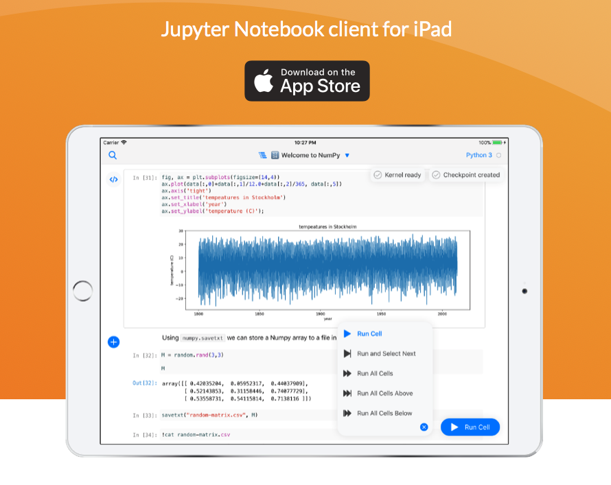

<div align='center'></div>

Juno 라는 주피터-아이패드 연동앱이 출시되었습니다.

주피터를 아이패드에서 돌리는 건 아니고 외부의 주피터 서버에 접속하여 쓰는 방식입니다. 기본적으로 Azure notebook, COCALC 서버가 지원되고 두 서버는 무료로 사용 가능합니다.

문제는 제 주피터 서버에 접속하여 사용하고 싶을 때인데 뭐 때문인지는 잘 모르겠지만.. 하여튼 어렵네요.

저는 노트북 맥북과 아이패드를 먼저 연동해보았다. 먼저 ssl 인증을 받아야하는데 그 과정은 juno 사이트에 잘 설명되어 있으니 참고하면 됩니다.

<a href="https://juno.sh/ssl-self-signed-cert/">Juno 가이드 보기</a>

하지만, 이대로 따라해도 아마 안되는 사람도 있을 겁니다. 저도 그랬는데 이게 나온지 얼마 안된 앱이라 정보가 상당히 없기도 합니다... 어쨋든 전 연동에 성공했는데 다음과 과정을 추가로 거치면 됩니다.

먼저 터미널을 이용해 .jupyter로 들어갑니다.

```
cd .jupyter
```

.jupyter 안에 있는 jupyter_notebook_config.py 를 엽니다. 만일 이 파일이 없다면, 터미널에서 다음을 실행합니다

```
jupyter notebook --generate-config

```

파일을 열고 다음 둘을 찾아 바꾸어줍니다.

```
c.NotebookApp.ip = '자신의 사설IP'
c.NotebookApp.allow_origin = '*'
```

현재 저는 이렇게 하였더니 맥북과 아이패드는 연동이 됩니다. 하지만 우분투 노트북은 ssl 인증이 되질 않습니다.. 이 부분에 대해선 문의를 해봐야겠네요.
