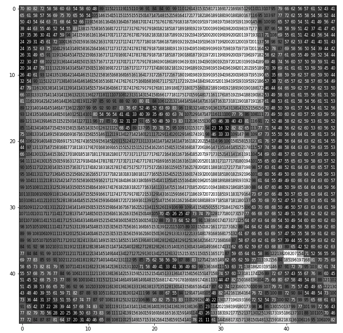
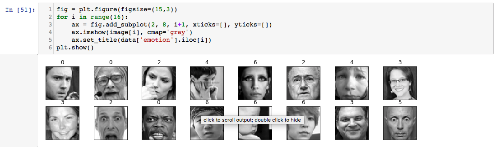

{:toc}
<h2>Intro</h2>

저번의 미소 인식을 좀 더 업데이트하여 표정에서 나타나는 감정 인식을 해보았다. 미소 인식에선 미소 짓는 표정과 아닌 표정 두가지 뿐이라 상대적으로 데이터가 간단해 학습이 간단했다. 또 미소는 표정만으로 미소이다 혹은 아니다 라고 구분이 가능해서 고려할 것이 많지 않았다. 실제로 인간이 느끼기에 슬픈거나 억지로 하는 미소는 신경쓰지 않기 때문이다.

반면 표정에서 나타나는 감정은 상당히 복잡하다. 표정과 감정이 일치하지 않을 때도 있고 두가지 이상의 감정이 복합적으로 나타날 때가 대부분이다. 우리는 표정에서 감정을 쉽게 읽을 수 있지만, 어떤 표정이 왜 어떤 한 감정 또는 두가지 이상의 복합적 감정으로 보이는지 설명하려고 하면 쉽지 않다. 눈썹의 위치, 입가의 모양과 같은 특징으로 대략 적인 설명만이 가능할 뿐이다. 또 표정을 보고 감정을 확신하기 보단 어떤 감정인 거 같아 라고 추측한다.

딥러닝으로 인간과 비슷한 방식으로 감정을 추측해 볼 수 있다. 우리가 평생 살면서 그래 왔던 것처럼 많은 표정을 보여주고 학습을 시킨다. 모델은 자기가 본 데이터에 기반하여 인간의 직관처럼 보이는 것으로 감정을 추측한다. 인간의 직관과 다른 점은 감정을 확률로 표현하기에 감정의 순위를 볼 수 있다는 것과 모델이 어떻게 감정을 추측하는 지 레이어를 뜯어보면 대략 볼 수 있다는 것이다.

<h2>Process</h2>
데이터는 ICML Challenge에서 사용되었던 데이터를 캐글에서 받았다. 지금은 진행되는 대회도 아니니 데이터셋 학습 데이터로 사용하여도 된다. 데이터 처리를 거친 후 vgg를 흉내낸 모델로 학습을 한다. 모델이 너무 deep하면 정확도는 좋겠지만, 실시간으로 사용하지 못한다. 실시간 인식은 cpu만으로 하기 때문에 적당한 크기의 모델을 만들어야 한다. 정확도와 속도를 trade-off 한다고 생각하면 된다. 내가 만든 모델은 3개의 conv 레이어를 가지고 조합한 모델로 60%의 정확도를 보였다. 사실 정확도로 보면 굉장히 안좋은 성능 같지만, 실제로 돌려보면 꽤 괜찮게 인식한다. 학습이 끝난 모델을 저장한 후 영상에 넣어 처리하면 감정 인식이 가능하다.
<h2>Code</h2>
```
# usage
# python emotion_detectot.py --cascade haarcascade_frontalface_default.xml --model output/epoch_75.hdf5

from keras.preprocessing.image import img_to_array
from keras.models import load_model
import numpy as np
import argparse
import imutils
import cv2

ap = argparse.ArgumentParser()
ap.add_argument('-c', '--cascade', required = True)
ap.add_argument('-m', '--model', required = True)
ap.add_argument('-v', '--video')
args = vars(ap.parse_args())

#load face detector cascade
detector = cv2.CascadeClassifier(args['cascade'])
model = load_model(args['model'])
EMOTIONS = ['angry', 'scared', 'happy', 'sad', 'surprised', 'neutral']

if not args.get('video', False):
camera = cv2.VideoCapture(0)

else:
camera = cv2.VideoCapture(args['video'])

while True:
(grabbed, frame) = camera.read()

if args.get('video') and not grabbed:
break
# resize the frame and convert it to grayscale
frame = imutils.resize(frame, width=700)
gray = cv2.cvtColor(frame, cv2.COLOR_BGR2GRAY)

#initialize the canvas for the visualization, clone
# the frame so we can draw on it
canvas = np.zeros((220, 400, 3), dtype= 'uint8')
frameClone = frame.copy()

rects = detector.detectMultiScale(gray, scaleFactor = 1.1,
minNeighbors = 5, minSize = (30, 30),
flags = cv2.CASCADE_SCALE_IMAGE)

if len(rects) >0:
#face area
rect = sorted(rects, reverse=True, key = lambda x: (x[2] - x[0]) * (x[3] - x[1]))[0]
(fX, fY, fW, fH) = rect

roi = gray[fY:fY+fH, fX:fX+fW]
roi = cv2.resize(roi, (48, 48))
roi = roi.astype('float')/255.0
roi = img_to_array(roi)
roi = np.expand_dims(roi, axis = 0)

#preds
preds = model.predict(roi)[0]
label = EMOTIONS[preds.argmax()]

for (i, (emotion, prob)) in enumerate(zip(EMOTIONS, preds)):
text = "{}: {:.2f}%".format(emotion, prob*100)

w= int(prob * 300)
cv2.rectangle(canvas, (5, (i*35) + 5),
(w, (i*35)+35), (0,0,225), -1)
cv2.putText(canvas, text, (10, (i * 35) + 23),
cv2.FONT_HERSHEY_SIMPLEX, 0.45, (255,255,255), 2)

cv2.putText(frameClone, label, (fX, fY-10), cv2.FONT_HERSHEY_SIMPLEX, 0.45, (255,0,0), 2)
cv2.rectangle(frameClone, (fX, fY), (fX+fW, fY+fH),(255,0,0), 2)

cv2.imshow("face", frameClone)
cv2.imshow("prob", canvas)

if cv2.waitKey(1) & 0xFF == ord('q'):
break

camera.release()
cv2.destroyAllWindows()
```
<h2>Test</h2>

<iframe width="560" height="315" src="https://www.youtube.com/embed/7JK4Y2Sn1f4" frameborder="0" allow="autoplay; encrypted-media" allowfullscreen></iframe>

<h2>Problem</h2>
이번에 코딩을 하면서 새로운 걸 배웠다. 나는 로컬에서 코딩을 다 한 후 돌아가나 확인 후 파일을 aws ec2에 옮겨 ec2에서 모델을 돌린 후 저장된 파일을 다시 로컬로 옮겨 사용한다. 이번에도 역시 같은 방법으로 했는데 갑자기 ec2에서 돌리고 나서 로컬에서 사용해보니 코드가 돌아가질 않았다. 에러는 버전 문제였다. 이전에는 어쩌다 잘 맞았는지 에러가 안나서 몰랐었는데 나의 로컬 파이썬은 3.5 버전이고 ec2는 3.6 버전이라 발생하는 에러였다. 로컬에 가상 환경을 만들어주니 잘된다.
