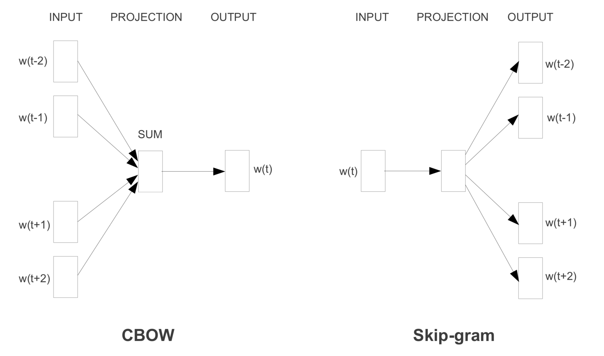

## Word2Vec - skip gram
Word2Vec은 말 그대로 단어를 벡터 공간으로 표현하는 방법으로 단어를 벡터화하는 연구는 이전에도 NNLM, RNNLM과 같이 연구가 되오던 분야입니다. 이름에서 알 수 있듯이 둘 다 인공신경망 기반의 임베딩 기법입니다. 그런데 저 두 기법보다 word2vec이 훨씬 자주 보이는 이유는 역시 성능이 훨씬 좋기 때문이죠. 왜냐면 word2vec 모델은 기본적으로 매우 간단합니다. Input, Hidden, Output 레이어가 하나씩만 있으면 됩니다. 그래서 학습이 빠르고 많은 단어 뭉치를 학습시킬 수 있으니 성능이 높아질 수 밖에 없습니다. 또 word2vec은 단어간의 의미의 유사함, 통사적 유사함을 훨씬 더 정교하게 표현 할 수 있습니다.

구글 연구팀은 논문에 두개의 모델을 제시했습니다. CBoW와 Skip-gram으로 CBow는 주변의 단어를 이용해 하나의 단어는 찾아내는 방법이고 Skip-gram은 하나의 단어에서 여러 단어를 예측하는 방법입니다. 결과적으로는 좋은 성능을 보이는 Skip-gram이 대세라고 합니다. 논문의 성능표를 보면 의미 분석에서는 다른 모델보다 월등히 좋은 성능을 보입니다.

   

## Process
Word2vec의 목표는 hidden layer의 weight를 학습하는 것입니다. 이 weights가 바로 word vector 입니다. Autoencoder 처럼 학습된 parameter를 사용합니다. 이런 방법은 한번 학습이 되고 나서는 lookup table처럼 쓸 수 있고 또 word vector의 feature를 자신의 모델에 맞게 조절 할 수 있습니다. 그렇지만 한번 학습이 된 벡터에 학습할때에 없던 새로운 단어를 인풋으로는 사용할 수 없습니다.

  

더 자주 쓰인다는 Skip gram model는 이렇게 생겼습니다. 인풋으로는 one-hot vector로 변환된 string들이 올겁니다. 위의 그림에서 인풋은 10,000개의 단어를 갖고 있고 ants 라는 인풋이 들어간 상태죠. 이제 인풋은 hidden layer를 거쳐 output layer를 통해 나옵니다. 결과는 softmax classifier 통해 나온 10,000개의 벡터로, 그 의미는 ants라는 인풋이 들어갔을 때 그 주변에 있을 단어들의 확률이 나오겠죠. 예를 들면 ants라는 단어 주변에 bee 라는 단어가 있을 확률이나 iphone이라는 단어가 나올 확률들이 각각 나오는 것입니다.
그러나 Output은 학습용이지 어차피 우리의 목표가 아니죠. 이 10,000개의 아웃풋은 대부분이 0에 가까울 것이고 몇몇만 높은 확률을 가질 겁니다.
우리가 관심있는 건 이 결과를 만드는 Hidden layer입니다. 위의 그림에서는 300개의 뉴런이 있습니다. 이 hidden layer는 10,000개의 단어를 인풋으로 받으니 [10000,300]인 행렬이 될겁니다. 이 행렬이 학습된 후 단어를 넣으면 그것에 대한 단어 벡터를 내뱉게 되죠.
예를 들어 인풋은 one-hot vector로 넣는다고 했으니 [0 0 0 1 0] 과 같은 형태이고 이때의 hidden layer는 [5 3] 형태일겁니다. 그럼 결과는 hidden layer에서 인풋 1에 해당하는 row vector가 나올 것입니다. 즉, Hidden layer의 각 행렬은 그 행렬에 해당하는 단어의 word vector 입니다. 하지만 테스트 과정에서 학습되지 않은, 즉 처음 보는 단어가 들어가면 아쉽게도 아무것도 할 수 없습니다. 따로 처리가 필요한 부분이죠.

  

## So
이렇게 학습된 word vector는 비슷한 단어에 대해선 비슷한 결과는 냅니다. 그러면 비슷한 row vector를 갖고 있는 것들은 비슷한 단어라는 의미가 됩니다. 그럼 이 row vector들의 dissimilarity, 거리를 cosine 거리로 구하면? 그럼 비슷한 단어들끼리 묶이게 되죠. 그리고 그것들을 공간에 뿌려놓으면 ant, ants 와 같은 것들이 비슷한 곳에 모여있는 것을 보게 됩니다. 결과적으로 아래 그림 같은 단어 벡터들이 만들어 지는 것이죠.

  

